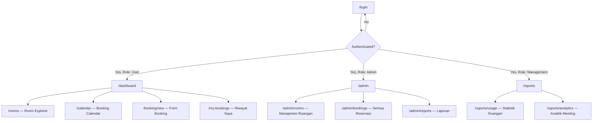

# 🏢 SI-BOOK Frontend Implementation Plan
**Sistem Informasi Booking Ruangan Meeting — Frontend Architecture**

---

## 1. Konteks & Foundation

### Aset Desain yang Sudah Ada
Dari percakapan sebelumnya, kita sudah memiliki **Stitch Project "Ruangan Meeting Web"** (ID: `6133659017902481585`) dengan design system **"The Executive Sanctuary"** dan 6 screen yang sudah di-generate:

| # | Screen | Stitch ID |
|---|--------|-----------|
| 1 | Halaman Login | `773d6c5aa10e4ec09af77bd8eba671df` |
| 2 | Dashboard Admin | `e72ec91fcdfb448fb28aa933b6d9c67b` |
| 3 | Manajemen Ruangan | `4c5f69712cb841268a886581e153379d` |
| 4 | Kalender Jadwal | `872be2086f3c42138427b284fd16b515` |
| 5 | Form Pemesanan Ruangan | `f9584c0f69a64c378302fd9e03567013` |
| 6 | Executive Hub Workspace | `58eceb86ca54401a95312801eebbd22c` |

### Tech Stack yang Dipilih

| Layer | Teknologi | Alasan |
|-------|-----------|--------|
| **Framework** | **Vite + React 19** | Hot reload cepat, build ringan, ekosistem besar |
| **Routing** | **React Router v7** | Nested routes, role-based guards |
| **State Management** | **React Context + useReducer** | Cukup untuk scope CRUD, tanpa overhead Redux |
| **Styling** | **Vanilla CSS + CSS Custom Properties** | Sesuai design system token, full kontrol tanpa dependency berat |
| **Calendar** | **FullCalendar React** | Kalender interaktif production-ready |
| **Charts** | **Recharts** | Untuk laporan & analitik |
| **HTTP Client** | **Axios** | Interceptors untuk auth token |
| **Form Validation** | **React Hook Form + Zod** | Validasi schema yang type-safe |
| **Icons** | **Lucide React** | Icon set ringan & konsisten |

---

## 2. Design System: "The Executive Sanctuary"

### 2.1 Color Tokens (CSS Custom Properties)

```css
:root {
  /* === Surface Hierarchy (No-Line Rule) === */
  --surface:                 #f7fafc;
  --surface-container-low:   #f1f4f6;
  --surface-container:       #ebeef0;
  --surface-container-high:  #e5e9eb;
  --surface-container-highest: #e0e3e5;
  --surface-container-lowest: #ffffff;
  --surface-bright:          #f7fafc;
  --surface-dim:             #d7dadc;

  /* === Brand Colors === */
  --primary:                 #002045;
  --primary-container:       #1a365d;
  --primary-fixed:           #d6e3ff;
  --primary-fixed-dim:       #adc7f7;
  --on-primary:              #ffffff;
  --on-primary-container:    #86a0cd;

  /* === Functional Colors === */
  --tertiary-container:      #003e28;  /* Available / Success */
  --on-tertiary-container:   #00b47d;
  --error-container:         #ffdad6;  /* Occupied / Error */
  --on-error-container:      #93000a;

  /* === Text Colors === */
  --on-background:           #181c1e;  /* Never use #000000 */
  --on-surface:              #181c1e;
  --on-surface-variant:      #43474e;
  --outline:                 #74777f;
  --outline-variant:         #c4c6cf;
}
```

### 2.2 Typography System

| Role | Font | Size | Weight | Letter Spacing |
|------|------|------|--------|----------------|
| Display Large | Manrope | 3.5rem | 700 | -0.02em |
| Headline Medium | Manrope | 1.75rem | 600 | -0.02em |
| Title Large | Inter | 1.375rem | 600 | 0 |
| Title Medium | Inter | 1rem | 600 | 0.01em |
| Body Large | Inter | 1rem | 400 | 0.03em |
| Body Medium | Inter | 0.875rem | 400 | 0.02em |
| Label Large | Inter | 0.875rem | 500 | 0.01em |
| Label Small | Inter | 0.6875rem | 500 | 0.05em |

### 2.3 Prinsip Kunci Design

> [!IMPORTANT]
> **The "No-Line" Rule** — Dilarang menggunakan `border: 1px solid` untuk pemisah. Semua batas antar section didefinisikan melalui pergeseran warna background (tonal layering).

> [!IMPORTANT]
> **Glassmorphism** — Sidebar navigasi dan elemen floating harus menggunakan `backdrop-filter: blur(12px)` dengan opacity 80%.

> [!IMPORTANT]
> **Ambient Shadows** — Tidak ada drop shadow hitam. Gunakan `box-shadow: 0 20px 40px rgba(0, 27, 60, 0.06)` (tinted dari primary).

---

## 3. Arsitektur Navigasi & Routing

### 3.1 Sitemap & Hierarki Halaman



### 3.2 Struktur Route

```
/
├── /login                    → Halaman Login (public)
│
├── /dashboard                → Dashboard User (protected: user)
├── /rooms                    → Room Explorer/Catalog (protected: user)
├── /rooms/:roomId            → Detail Ruangan (protected: user)
├── /calendar                 → Booking Calendar View (protected: user)
├── /booking/new              → Form Booking Baru (protected: user)
├── /booking/new?room=:id     → Form Booking (pre-selected room)
├── /my-bookings              → Booking Saya (protected: user)
│
├── /admin                    → Dashboard Admin (protected: admin)
├── /admin/rooms              → Manajemen Ruangan CRUD (protected: admin)
├── /admin/rooms/new          → Tambah Ruangan Baru (protected: admin)
├── /admin/rooms/:roomId/edit → Edit Ruangan (protected: admin)
├── /admin/bookings           → Semua Reservasi (protected: admin)
├── /admin/reports            → Laporan & Analitik (protected: admin)
│
└── /reports                  → Dashboard Manajemen (protected: management)
```

### 3.3 Navigasi Utama — Sidebar Layout

Layout menggunakan pola **Persistent Sidebar + Content Area**:

```
┌──────────────────────────────────────────────────┐
│                  Top Bar (sticky)                 │
│  [Search]              [Notifications] [Profile]  │
├────────────┬─────────────────────────────────────┤
│            │                                      │
│  Sidebar   │         Main Content Area            │
│  (glassmor │                                      │
│  phism,    │    ┌──────────────────────────┐      │
│  fixed)    │    │  Page Content             │      │
│            │    │  (scrollable)             │      │
│  ┌──────┐  │    │                           │      │
│  │ Logo │  │    └──────────────────────────┘      │
│  └──────┘  │                                      │
│            │                                      │
│  Dashboard │                                      │
│  Ruangan   │                                      │
│  Kalender  │                                      │
│  Booking   │                                      │
│  Riwayat   │                                      │
│            │                                      │
│  ──────── │                                      │
│  Settings  │                                      │
│  Logout    │                                      │
│            │                                      │
├────────────┴─────────────────────────────────────┤
```

**Menu items berdasarkan role:**

| Menu Item | Icon | User | Admin | Management |
|-----------|------|:----:|:-----:|:----------:|
| Dashboard | LayoutDashboard | ✅ | ✅ | ✅ |
| Ruangan | Building2 | ✅ | ✅ (CRUD) | ❌ |
| Kalender | CalendarDays | ✅ | ✅ | ❌ |
| Booking Baru | Plus | ✅ | ✅ | ❌ |
| Booking Saya | ClipboardList | ✅ | ❌ | ❌ |
| Semua Reservasi | ListChecks | ❌ | ✅ | ❌ |
| Laporan | BarChart3 | ❌ | ✅ | ✅ |
| Pengaturan | Settings | ✅ | ✅ | ✅ |

---

## 4. Breakdown Per Halaman

### 4.1 Halaman Login (`/login`)

**Layout:** Full-screen, no sidebar. Split layout (2 kolom).

```
┌─────────────────────┬──────────────────────┐
│                     │                      │
│   Gradient Hero     │    Login Form        │
│   (primary →        │                      │
│    primary-         │    ┌──────────────┐  │
│    container)       │    │ Logo         │  │
│                     │    │              │  │
│   Tagline:          │    │ Email Input  │  │
│   "Curate Your      │    │ Password     │  │
│    Executive        │    │ Remember Me  │  │
│    Space"           │    │              │  │
│                     │    │ [Sign In]    │  │
│   Ilustrasi         │    │              │  │
│   kantor modern     │    │ SSO Options  │  │
│                     │    └──────────────┘  │
│                     │                      │
└─────────────────────┴──────────────────────┘
```

**Komponen:**
- `LoginHero` — Gradient background + tagline + ilustrasi
- `LoginForm` — Email, password, remember me, validation
- `SSOButton` — Google/Microsoft SSO (opsional)

**Interaksi:**
- Input field: "Soft Inset" style (`surface_container_highest`, no border)
- Focus state: Ghost border `primary` 20% opacity + 4px glow
- Button: Gradient CTA (`primary` → `primary-container`)
- Error toast: slide-in dari kanan atas

---

### 4.2 Dashboard User (`/dashboard`)

**Tujuan:** Overview cepat — ruangan tersedia hari ini, booking mendatang, quick actions.

```
┌─────────────────────────────────────────────────┐
│  Welcome back, {name}               April 2026  │
├─────────────────────────────────────────────────┤
│                                                  │
│  ┌──────────┐ ┌──────────┐ ┌──────────┐        │
│  │ 12       │ │ 5        │ │ 3        │        │
│  │ Ruangan  │ │ Tersedia │ │ Booking  │        │
│  │ Total    │ │ Sekarang │ │ Hari Ini │        │
│  └──────────┘ └──────────┘ └──────────┘        │
│                                                  │
│  Booking Mendatang                    View All → │
│  ┌──────────────────────────────────────────┐   │
│  │ ⏰ Rapat Tim Product  │ Ruang A │ 10:00  │   │
│  │ ⏰ Sprint Review       │ Ruang C │ 14:00  │   │
│  │ ⏰ 1-on-1 Mentoring    │ Ruang B │ 16:00  │   │
│  └──────────────────────────────────────────┘   │
│                                                  │
│  Ruangan Populer            ┌─────────────────┐ │
│  ┌─────────┐ ┌─────────┐   │  Mini Calendar  │ │
│  │ Room A  │ │ Room B  │   │  (sidebar)      │ │
│  │ ★ 4.8   │ │ ★ 4.5   │   │                 │ │
│  └─────────┘ └─────────┘   └─────────────────┘ │
└─────────────────────────────────────────────────┘
```

**Komponen:**
- `StatCard` — Statistik ringkas (icon + angka + label)
- `UpcomingBookingList` — List booking mendatang user
- `PopularRoomCard` — Preview ruangan populer
- `MiniCalendar` — Kalender kecil navigasi cepat
- `QuickBookButton` — FAB untuk booking cepat

---

### 4.3 Dashboard Admin (`/admin`)

**Tujuan:** Overview operasional — total booking hari ini, rate occupancy, alert konflik.

```
┌─────────────────────────────────────────────────┐
│  Admin Dashboard                    April 2026   │
├─────────────────────────────────────────────────┤
│                                                  │
│  ┌────────┐ ┌────────┐ ┌────────┐ ┌────────┐   │
│  │ 24     │ │ 85%    │ │ 12     │ │ 0      │   │
│  │ Total  │ │ Occup. │ │ Active │ │ Confli │   │
│  │ Booking│ │ Rate   │ │ Now    │ │ -cts   │   │
│  └────────┘ └────────┘ └────────┘ └────────┘   │
│                                                  │
│  ┌─────────────────────┐  ┌──────────────────┐  │
│  │ Booking Trend       │  │ Room Utilization │  │
│  │ (Line Chart 7 hari) │  │ (Bar Chart)      │  │
│  └─────────────────────┘  └──────────────────┘  │
│                                                  │
│  Recent Activity                                 │
│  ┌──────────────────────────────────────────┐   │
│  │ User X membooking Ruang A — 5 min ago    │   │
│  │ User Y membatalkan Ruang C — 12 min ago  │   │
│  └──────────────────────────────────────────┘   │
└─────────────────────────────────────────────────┘
```

**Komponen:**
- `AdminStatCard` — 4 kartu KPI
- `BookingTrendChart` — Line chart (Recharts)
- `RoomUtilizationChart` — Horizontal bar chart per ruangan
- `RecentActivityFeed` — Timeline aktivitas terbaru

---

### 4.4 Room Explorer (`/rooms`)

**Tujuan:** Browse & filter ruangan, lihat ketersediaan real-time.

```
┌─────────────────────────────────────────────────┐
│  Explore Rooms                                   │
│  ┌────────────────────────────────────────────┐  │
│  │ 🔍 Search rooms...   │ Filter ▼ │ Grid ☷ │  │
│  └────────────────────────────────────────────┘  │
│                                                  │
│  ┌─────────────┐ ┌─────────────┐ ┌───────────┐  │
│  │ 📸          │ │ 📸          │ │ 📸        │  │
│  │             │ │             │ │           │  │
│  │ Ruang Direksi│ │ Ruang Rapat │ │ Small     │  │
│  │ Lt.5        │ │ Lt.3        │ │ Meeting   │  │
│  │ 👥 20 orang │ │ 👥 12 orang │ │ 👥 6 org  │  │
│  │ 🟢 Available│ │ 🔴 Occupied │ │ 🟢 Open   │  │
│  │             │ │             │ │           │  │
│  │ [Book Now]  │ │ [View]      │ │ [Book]    │  │
│  └─────────────┘ └─────────────┘ └───────────┘  │
│                                                  │
│  ┌─────────────┐ ┌─────────────┐ ┌───────────┐  │
│  │ ...         │ │ ...         │ │ ...       │  │
│  └─────────────┘ └─────────────┘ └───────────┘  │
└─────────────────────────────────────────────────┘
```

**Komponen:**
- `SearchBar` — Search + filter (kapasitas, lantai, fasilitas)
- `RoomCard` — Foto ruangan, nama, kapasitas, status badge, CTA
- `StatusBadge` — Pill badge (Available: emerald, Occupied: coral)
- `RoomFilterDrawer` — Drawer/panel filter lanjutan
- `ViewToggle` — Grid / List view switch

**Interaksi Kartu:**
- Hover: Background → `surface-bright`, shadow diffusion naik
- Klik: Navigate ke `/rooms/:roomId`
- Book Now: Navigate ke `/booking/new?room=:roomId`

---

### 4.5 Manajemen Ruangan — Admin (`/admin/rooms`)

**Tujuan:** CRUD data ruangan.

```
┌─────────────────────────────────────────────────┐
│  Room Management               [+ Tambah Ruangan]│
├─────────────────────────────────────────────────┤
│  🔍 Search...                    Filter ▼        │
│                                                  │
│  ┌──────────────────────────────────────────┐   │
│  │ Foto │ Nama Ruangan │ Lantai │ Kapasitas│   │
│  │──────│──────────────│────────│──────────│   │
│  │ 📸   │ Ruang Direksi│ Lt. 5  │ 20 orang │   │
│  │      │              │        │ ⚙ Edit ❌│   │
│  │ 📸   │ Ruang Rapat A│ Lt. 3  │ 12 orang │   │
│  │      │              │        │ ⚙ Edit ❌│   │
│  └──────────────────────────────────────────┘   │
│                                                  │
│  Showing 1-10 of 24          < 1 2 3 >           │
└─────────────────────────────────────────────────┘
```

> [!NOTE]
> Tabel menggunakan zebra striping (`surface` / `surface-container-low`) bukan garis pembatas, sesuai "No-Line Rule".

**Komponen:**
- `DataTable` — Reusable table (sort, paginate, selectable)
- `RoomFormModal` — Modal form (glassmorphism overlay) untuk add/edit
- `ImageUploader` — Drag & drop upload foto ruangan
- `FacilityTagInput` — Multi-select tag untuk fasilitas
- `ConfirmDeleteDialog` — Konfirmasi hapus

---

### 4.6 Kalender Booking (`/calendar`)

**Tujuan:** Visualisasi jadwal seluruh ruangan dalam format kalender.

```
┌─────────────────────────────────────────────────┐
│  Booking Calendar                                │
│  ┌────────────────────────────────────────────┐  │
│  │ < April 2026 >    │ Day │ Week │ Month │   │  │
│  └────────────────────────────────────────────┘  │
│                                                  │
│  ┌──────────────────────────────────────────┐   │
│  │         Mon    Tue    Wed    Thu    Fri   │   │
│  │ Ruang A │ ██  │      │ ████ │      │ ██ ││   │
│  │ Ruang B │     │ ███  │      │ ██   │    ││   │
│  │ Ruang C │ ███ │      │      │ ████ │    ││   │
│  │ Ruang D │     │ ██   │ ██   │      │ ███││   │
│  └──────────────────────────────────────────┘   │
│                                                  │
│  🔵 Booking Saya   ⬛ Booking Lain   🟢 Kosong  │
└─────────────────────────────────────────────────┘
```

**Komponen:**
- `BookingCalendar` — FullCalendar wrapper, resource timeline view
- `CalendarToolbar` — Navigasi tanggal + view switcher (Day/Week/Month)
- `EventPopover` — Popover saat hover event (detail booking)
- `QuickBookSlot` — Klik slot kosong → langsung buka form

**Interaksi:**
- **Klik slot kosong** → Buka form booking dengan tanggal/ruangan pre-filled
- **Klik event** → Popover detail booking
- **Drag & resize** (admin only) → Ubah durasi booking

---

### 4.7 Form Booking (`/booking/new`)

**Tujuan:** Formulir pemesanan ruangan meeting.

```
┌─────────────────────────────────────────────────┐
│  Buat Reservasi Baru                             │
├─────────────────────────────────────────────────┤
│                                                  │
│  ┌─ Detail Meeting ────────────────────────────┐ │
│  │                                              │ │
│  │  Judul Meeting *                             │ │
│  │  ┌──────────────────────────────────┐       │ │
│  │  │ Sprint Planning Q2                │       │ │
│  │  └──────────────────────────────────┘       │ │
│  │                                              │ │
│  │  Pilih Ruangan *          Jumlah Peserta *   │ │
│  │  ┌──────────────┐        ┌──────────┐       │ │
│  │  │ Ruang Direksi▼│        │ 12       │       │ │
│  │  └──────────────┘        └──────────┘       │ │
│  │                                              │ │
│  │  Tanggal *                                   │ │
│  │  ┌──────────────────────────────────┐       │ │
│  │  │ 📅 15 April 2026                  │       │ │
│  │  └──────────────────────────────────┘       │ │
│  │                                              │ │
│  │  Jam Mulai *            Jam Selesai *        │ │
│  │  ┌──────────────┐      ┌──────────────┐     │ │
│  │  │ ⏰ 10:00       │      │ ⏰ 12:00       │     │ │
│  │  └──────────────┘      └──────────────┘     │ │
│  │                                              │ │
│  │  ┌─ Timeline Ketersediaan ────────────────┐ │ │
│  │  │ 08 09 10 11 12 13 14 15 16 17 18      │ │ │
│  │  │ ░░ ░░ ██ ██ ██ ░░ ░░ ██ ██ ░░ ░░      │ │ │
│  │  │      ↑ Slot yang dipilih                 │ │ │
│  │  └────────────────────────────────────────┘ │ │
│  │                                              │ │
│  │  Catatan (Opsional)                          │ │
│  │  ┌──────────────────────────────────┐       │ │
│  │  │ Perlu snack box 12 pcs            │       │ │
│  │  └──────────────────────────────────┘       │ │
│  │                                              │ │
│  │         [Batal]              [Pesan Ruangan] │ │
│  └──────────────────────────────────────────────┘ │
└─────────────────────────────────────────────────┘
```

**Komponen:**
- `BookingForm` — React Hook Form + Zod validation
- `RoomSelector` — Dropdown dengan preview foto & kapasitas
- `DatePicker` — Kalender popup (styled sesuai design system)
- `TimeRangePicker` — Dual time selector
- `AvailabilityTimeline` — Horizontal scrolling timeline (bukan grid angka biasa)
- `ConflictAlert` — Alert real-time jika slot sudah terisi

**Validasi:**
- Judul wajib (min 3 karakter)
- Tanggal tidak boleh di masa lalu
- Jam selesai > jam mulai
- Jumlah peserta ≤ kapasitas ruangan
- **Validasi konflik real-time**: Cek ketersediaan saat ruangan/waktu berubah

---

### 4.8 Booking Saya (`/my-bookings`)

**Tujuan:** Riwayat & jadwal booking mendatang milik user.

```
┌─────────────────────────────────────────────────┐
│  Booking Saya                                    │
│  ┌──────────┐ ┌──────────┐ ┌──────────┐        │
│  │ Mendatang│ │ Selesai  │ │ Dibatal- │        │
│  │  (5)     │ │ (23)     │ │ kan (2)  │        │
│  └──────────┘ └──────────┘ └──────────┘        │
├─────────────────────────────────────────────────┤
│                                                  │
│  ┌──────────────────────────────────────────┐   │
│  │ 🟢 Sprint Planning Q2                    │   │
│  │ Ruang Direksi │ 15 Apr 2026 │ 10:00-12:00│   │
│  │ 12 peserta                                │   │
│  │                      [Edit] [Batalkan]    │   │
│  ├──────────────────────────────────────────┤   │
│  │ 🟢 Weekly Standup                         │   │
│  │ Ruang Rapat A │ 16 Apr 2026 │ 09:00-09:30│   │
│  │ 8 peserta                                 │   │
│  │                      [Edit] [Batalkan]    │   │
│  └──────────────────────────────────────────┘   │
│                                                  │
│  Showing 1-5 of 5             < 1 >              │
└─────────────────────────────────────────────────┘
```

**Komponen:**
- `BookingTabFilter` — Tab: Mendatang / Selesai / Dibatalkan
- `BookingListItem` — Card per booking (status, detail, actions)
- `CancelBookingDialog` — Konfirmasi pembatalan
- `EditBookingModal` — Modal edit (re-use BookingForm)

---

### 4.9 Laporan & Analitik (`/admin/reports` & `/reports`)

**Tujuan:** Visualisasi data penggunaan ruangan.

```
┌─────────────────────────────────────────────────┐
│  Laporan & Analitik              [Export ⬇]      │
│  ┌──────────┐ ┌──────────┐                      │
│  │ Periode: │ │ Apr 2026 │ ▼                    │
│  └──────────┘ └──────────┘                      │
├─────────────────────────────────────────────────┤
│                                                  │
│  ┌─────────────────────┐  ┌──────────────────┐  │
│  │ Utilization Rate    │  │ Booking by Dept  │  │
│  │ (Donut Chart)       │  │ (Pie Chart)      │  │
│  │      78%            │  │                  │  │
│  └─────────────────────┘  └──────────────────┘  │
│                                                  │
│  ┌──────────────────────────────────────────┐   │
│  │ Tren Penggunaan (Area Chart - 30 hari)   │   │
│  │ ▓▓▓▓▓▓▓▓▓▓▓▓▓▓▓▓▓▓▓▓▓▓▓▓▓▓▓▓▓▓▓▓▓▓▓  │   │
│  └──────────────────────────────────────────┘   │
│                                                  │
│  Ruangan Terpopuler          Durasi Rata-rata    │
│  ┌─────────────────┐        ┌────────────────┐  │
│  │ 1. Ruang Direksi│        │ 1.5 jam        │  │
│  │ 2. Ruang Rapat A│        │ (avg meeting)  │  │
│  │ 3. Small Meeting│        │                │  │
│  └─────────────────┘        └────────────────┘  │
└─────────────────────────────────────────────────┘
```

**Komponen:**
- `DateRangeSelector` — Period picker
- `UtilizationDonut` — Recharts donut chart
- `DepartmentPieChart` — Booking by department
- `UsageTrendChart` — Area chart tren 30 hari
- `PopularRoomRanking` — Ranked list
- `ExportButton` — Export ke Excel/PDF

---

## 5. Component Library Architecture

### 5.1 Hierarki Komponen

```
src/
├── components/
│   ├── layout/
│   │   ├── AppShell.jsx          ← Wrapper utama (sidebar + topbar + content)
│   │   ├── Sidebar.jsx           ← Navigasi glassmorphism
│   │   ├── TopBar.jsx            ← Search, notifications, profile
│   │   └── ContentArea.jsx       ← Scrollable main content
│   │
│   ├── ui/                       ← Atomic design components
│   │   ├── Button.jsx            ← Gradient primary, ghost secondary
│   │   ├── Input.jsx             ← Soft-inset input fields
│   │   ├── Card.jsx              ← Surface-container-lowest, no border
│   │   ├── Badge.jsx             ← Status pill badges
│   │   ├── Modal.jsx             ← Glassmorphism overlay
│   │   ├── DataTable.jsx         ← Zebra-striped, no borders
│   │   ├── Tabs.jsx              ← Pill-style tab navigation
│   │   ├── Avatar.jsx            ← User avatars
│   │   ├── Tooltip.jsx           ← Ambient shadow tooltip
│   │   ├── Toast.jsx             ← Slide-in notifications
│   │   ├── Skeleton.jsx          ← Loading placeholder
│   │   └── EmptyState.jsx        ← Ilustrasi + text kosong
│   │
│   ├── booking/
│   │   ├── BookingForm.jsx       ← Form utama booking
│   │   ├── BookingCalendar.jsx   ← FullCalendar wrapper
│   │   ├── BookingListItem.jsx   ← Item di list booking
│   │   ├── AvailabilityTimeline.jsx ← Timeline horizontal
│   │   ├── TimeRangePicker.jsx   ← Pilih jam mulai/selesai
│   │   └── ConflictAlert.jsx     ← Alert slot bentrok
│   │
│   ├── rooms/
│   │   ├── RoomCard.jsx          ← Kartu ruangan
│   │   ├── RoomSelector.jsx      ← Dropdown pilih ruangan
│   │   ├── RoomFormModal.jsx     ← Form CRUD ruangan
│   │   ├── FacilityTagInput.jsx  ← Multi-tag fasilitas
│   │   └── ImageUploader.jsx     ← Upload foto
│   │
│   ├── dashboard/
│   │   ├── StatCard.jsx          ← Kartu statistik
│   │   ├── UpcomingBookings.jsx  ← List upcoming
│   │   ├── PopularRooms.jsx      ← Grid ruangan populer
│   │   ├── ActivityFeed.jsx      ← Timeline aktivitas
│   │   └── MiniCalendar.jsx      ← Kalender kecil
│   │
│   └── reports/
│       ├── UtilizationChart.jsx
│       ├── TrendChart.jsx
│       ├── DepartmentChart.jsx
│       ├── PopularRanking.jsx
│       └── ExportButton.jsx
│
├── pages/
│   ├── LoginPage.jsx
│   ├── DashboardPage.jsx
│   ├── AdminDashboardPage.jsx
│   ├── RoomExplorerPage.jsx
│   ├── RoomDetailPage.jsx
│   ├── RoomManagementPage.jsx
│   ├── CalendarPage.jsx
│   ├── BookingFormPage.jsx
│   ├── MyBookingsPage.jsx
│   └── ReportsPage.jsx
│
├── contexts/
│   ├── AuthContext.jsx           ← User auth state + role
│   ├── BookingContext.jsx        ← Booking state
│   └── ThemeContext.jsx          ← Dark/light mode toggle
│
├── hooks/
│   ├── useAuth.js
│   ├── useRooms.js
│   ├── useBookings.js
│   └── useMediaQuery.js
│
├── services/
│   ├── api.js                    ← Axios instance + interceptors
│   ├── authService.js
│   ├── roomService.js
│   └── bookingService.js
│
├── utils/
│   ├── dateHelpers.js
│   ├── validators.js
│   └── constants.js
│
├── styles/
│   ├── index.css                 ← Design tokens + global styles
│   ├── variables.css             ← CSS custom properties
│   ├── typography.css            ← Font imports + scales
│   ├── animations.css            ← Micro-animations
│   └── components/               ← Per-component CSS modules
│       ├── sidebar.css
│       ├── card.css
│       ├── button.css
│       └── ...
│
├── App.jsx                       ← Router setup
├── main.jsx                      ← Entry point
└── index.html
```

---

## 6. Responsive Design Strategy

### Breakpoints

| Breakpoint | Width | Layout |
|-----------|-------|--------|
| **Mobile** | < 768px | Sidebar → Bottom nav / Hamburger, single column |
| **Tablet** | 768px – 1024px | Collapsible sidebar (icon-only), 2-column grid |
| **Desktop** | > 1024px | Full sidebar + content area, 3-column grid |

### Mobile Adaptations
- **Sidebar** → Bottom navigation bar (5 item utama) + hamburger drawer untuk menu lengkap
- **Room cards** → Full-width, single column stack
- **Calendar** → Day view default (bukan week/month)
- **Form** → Full-width, single column
- **Tables** → Horizontal scroll atau card-based view

---

## 7. Animasi & Micro-interactions

| Element | Animasi | Duration | Easing |
|---------|---------|----------|--------|
| Page transition | Fade + slide up | 300ms | cubic-bezier(0.4, 0, 0.2, 1) |
| Card hover | Background shift + shadow grow | 200ms | ease-out |
| Modal appear | Backdrop fade + scale 0.95→1 | 250ms | spring |
| Toast notification | Slide in from right | 400ms | ease-out |
| Sidebar active pill | Width expand + bg fade | 200ms | ease-in-out |
| Button press | Scale 0.97 | 100ms | ease-in |
| Tab switch content | Fade cross-dissolve | 200ms | ease |
| Skeleton loading | Shimmer pulse | 1.5s | infinite ease-in-out |
| Status badge pulse | Subtle glow pulse | 2s | infinite |

---

## 8. Phased Development Roadmap

### Phase 1: Foundation (Week 1-2)
- [ ] Setup Vite + React project
- [ ] Implement CSS design system (tokens, typography, animations)
- [ ] Build core UI components (Button, Input, Card, Badge, Modal)
- [ ] Build AppShell layout (Sidebar, TopBar, ContentArea)
- [ ] Setup React Router with role-based guards
- [ ] Setup AuthContext with mock data

### Phase 2: Core Pages (Week 3-4)
- [ ] Login Page
- [ ] Dashboard User Page
- [ ] Room Explorer Page + RoomCard
- [ ] Booking Form Page + validation
- [ ] My Bookings Page

### Phase 3: Admin Features (Week 5-6)
- [ ] Dashboard Admin Page + charts
- [ ] Room Management Page (CRUD)
- [ ] All Bookings Management
- [ ] Booking Calendar (FullCalendar)

### Phase 4: Reports & Polish (Week 7-8)
- [ ] Reports & Analytics Page
- [ ] Export functionality (Excel/PDF)
- [ ] Responsive design (mobile/tablet)
- [ ] Micro-animations & transitions
- [ ] Dark mode support
- [ ] Performance optimization

### Phase 5: Integration (Week 9-10)
- [ ] Connect to backend API
- [ ] Email/WhatsApp notification integration
- [ ] Calendar integration (Google/Outlook)
- [ ] UAT & Bug fixes

---

## User Review Required

> [!IMPORTANT]
> **Keputusan yang perlu di-review:**
> 1. **Tech stack**: Apakah setuju dengan Vite + React? Atau lebih prefer Vue.js sesuai PRD?
> 2. **Scope halaman**: Apakah 9 halaman di atas sudah mencakup semua kebutuhan? Ada yang perlu ditambah/dikurangi?
> 3. **Prioritas fitur**: Dark mode dan integrasi kalender (Google/Outlook) ditempatkan di phase terakhir. Apakah ini perlu diprioritaskan?
> 4. **Mock data vs API**: Untuk development awal, saya akan menggunakan mock data (JSON statis). Kapan backend API akan tersedia?

> [!WARNING]
> **Kode HTML dari Stitch** sudah tersedia sebagai referensi visual. Namun, kode tersebut adalah single-file HTML dan perlu di-refactor menjadi komponen React yang modular. Desain visual akan dijaga semirip mungkin dengan output Stitch.

## Verification Plan

### Automated Tests
- Menjalankan `npm run dev` dan memverifikasi semua route bisa diakses
- Visual comparison dengan screenshot Stitch sebagai referensi
- Browser testing untuk responsivitas (desktop, tablet, mobile)

### Manual Verification
- Cross-browser testing (Chrome, Firefox, Edge)
- Aksesibilitas dasar (keyboard navigation, ARIA labels)
- Performa kalender (harus < 2 detik loading)
