# 📊 Mermaid Flowcharts — SI-BOOK
**Sistem Informasi Booking Ruangan Meeting**

---

## 1. Sitemap & Navigasi Utama

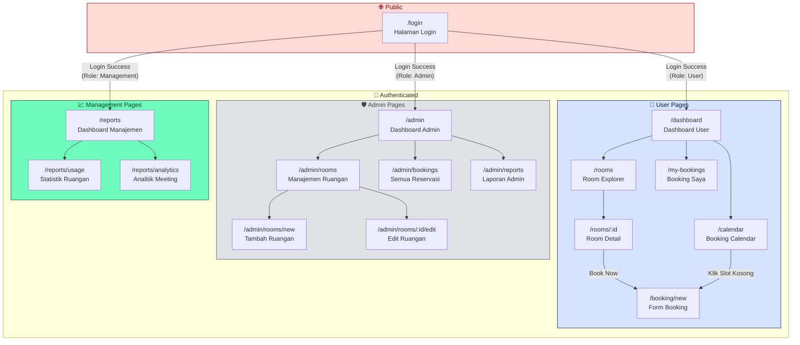

---

## 2. Alur Login & Autentikasi

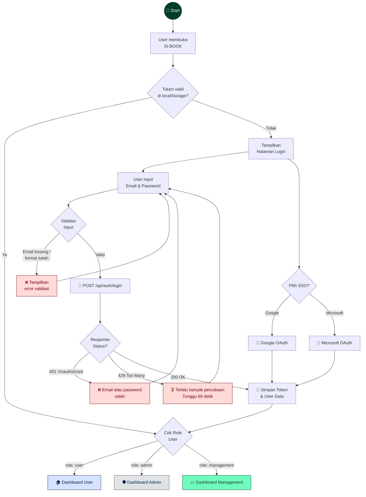

---

## 3. Alur Booking Ruangan (User Flow Utama)

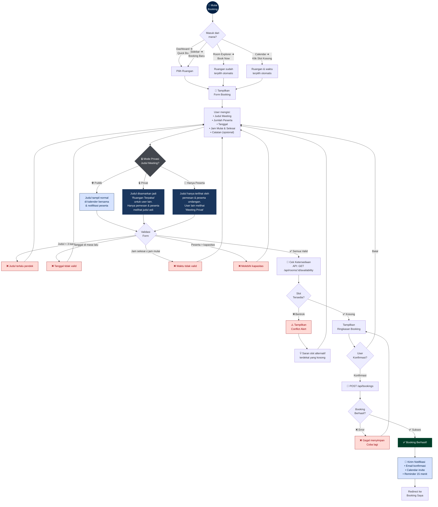

---

## 4. Alur Pembatalan Booking

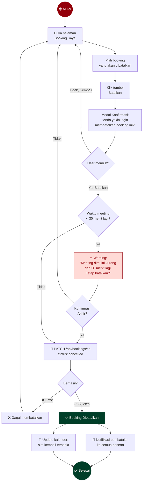

---

## 5. Alur CRUD Ruangan (Admin)

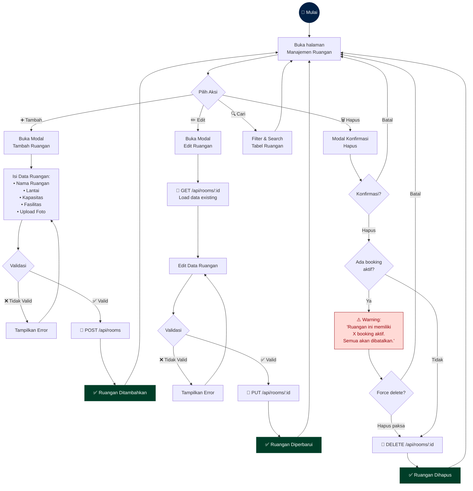

---

## 6. Alur Melihat Ketersediaan & Kalender

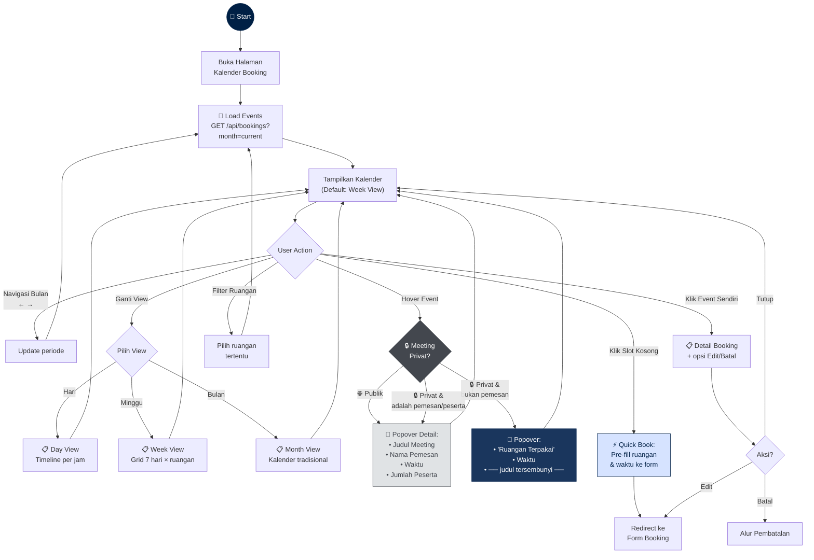

---

## 7. Alur Notifikasi & Reminder

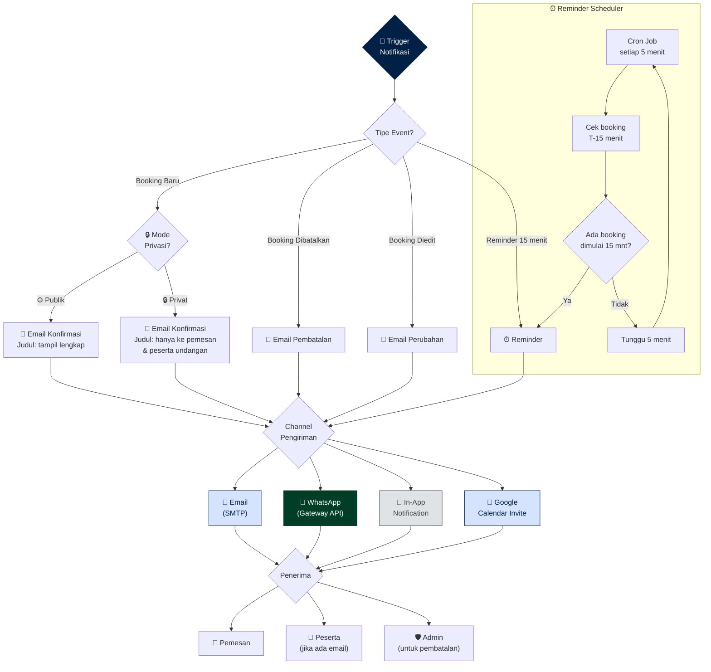

---

## 8. Alur Laporan & Export

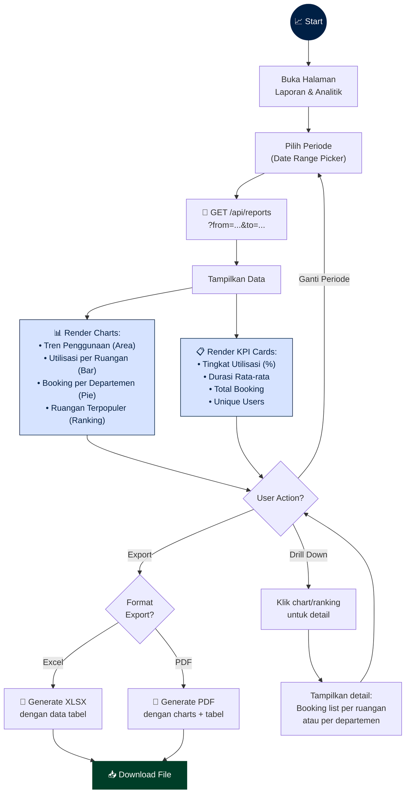

---

## 9. Component Hierarchy (Arsitektur Komponen)

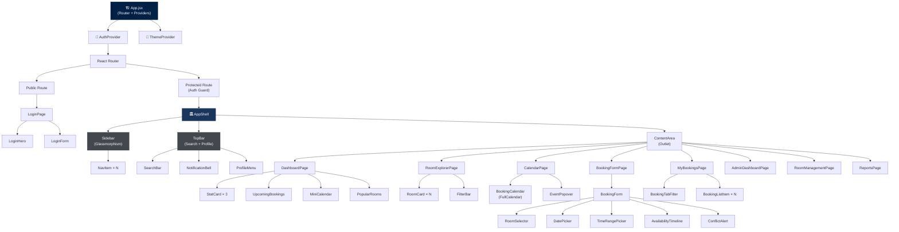

---

## 10. State Management Flow

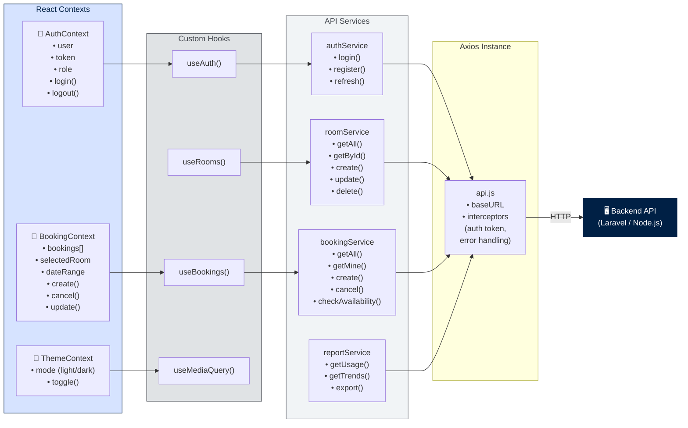

---

## 11. Role-Based Access Control (RBAC)

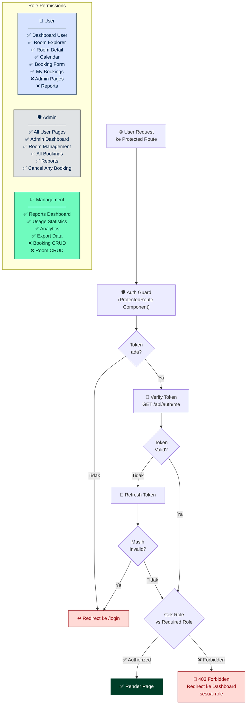

---

## 12. Responsive Layout Adaptation

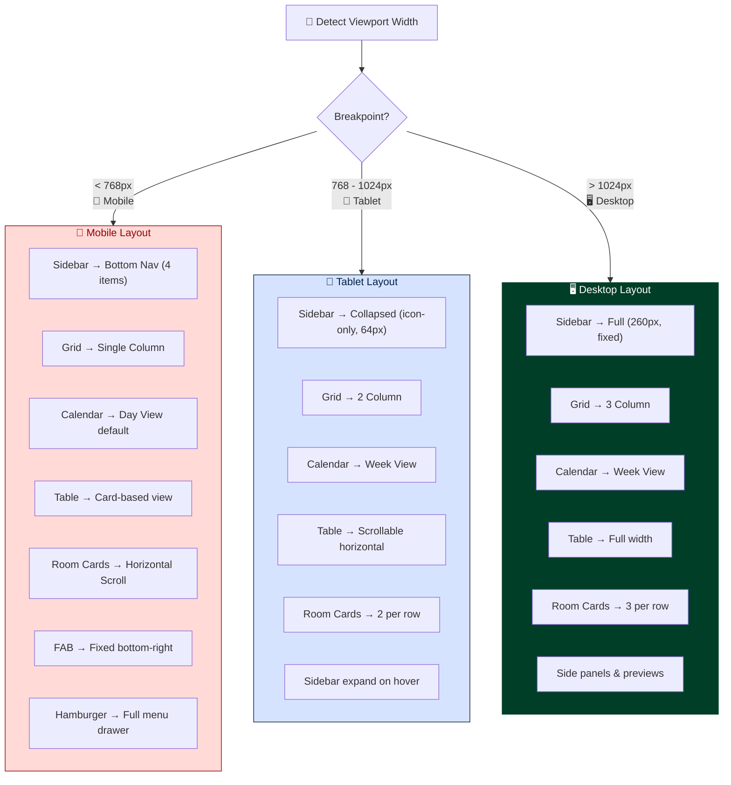

---

> [!TIP]
> **Cara menggunakan diagram ini:**
> - Diagram #2 dan #3 adalah **core user flows** — gunakan sebagai basis untuk development
> - Diagram #9 dan #10 adalah **arsitektur teknis** — gunakan sebagai panduan struktur kode
> - Diagram #11 adalah **security reference** — implementasikan di `ProtectedRoute` component
